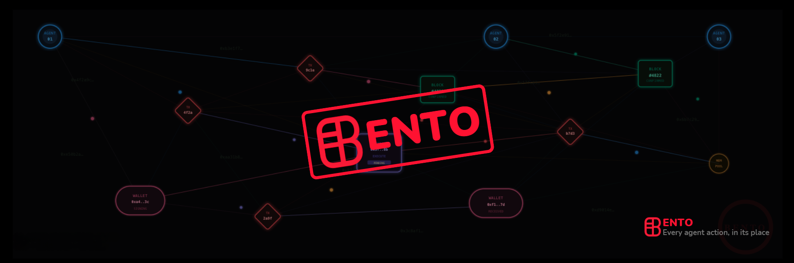

  

# About

**Problem**

AI agents are starting to control real money, from trading and bridging to interacting with DeFi protocols autonomously. But today, there is no reliable safety layer between an agent’s decision and onchain execution. A single bad prompt, hallucinated action, or malicious instruction can instantly put funds at risk, and once the transaction is executed, there is no undo button

**Solution**

Bento — The Encrypted Security Layer for Agentic Economy

- Protects autonomous agents before they touch real money, adding a safety layer between agent intent and onchain execution
- Checks, analyzes, and blocks risky actions before funds move, preventing bad trades, unsafe approvals, and costly mistakes
- Gives users a live security dashboard with threat scores, policy violations, and protected value, so agent activity is always visible
- Keeps sensitive rules, logic, and decision checks encrypted with Arcium, allowing policies to be enforced without exposing private data
- Turns agent security into a real-time control system, so users can run trading, bridging, and DeFi agents with confidence

Website: https://bentoguard.xyz